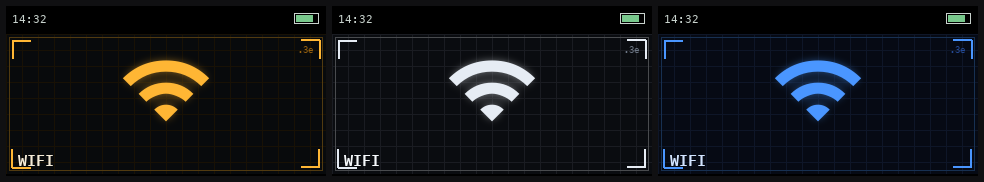
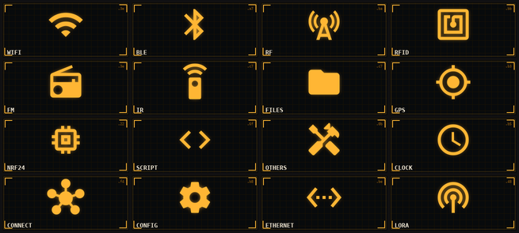
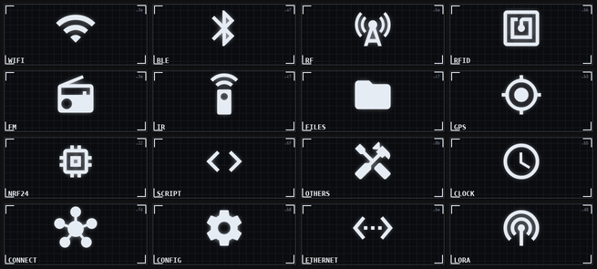
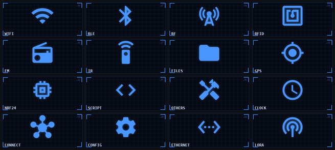

# 🎛️ Bruce HUD Themes

  

> **EN** — Three "instrument / HUD" UI themes for the **[Bruce firmware](https://github.com/BruceDevices/firmware)** on the LilyGO T-Embed CC1101 (320×170). Each menu entry shows a clean technical Material icon on a blueprint background with a subtle animated light sweep. Colorways: **Amber**, **White**, **Blue**. Copy a theme folder to the SD card, then pick it in `Config → UI Theme`.

Thèmes UI « instrument / HUD » pour le firmware **[Bruce](https://github.com/BruceDevices/firmware)**, pensés pour le **LilyGO T-Embed CC1101** (écran 320×170). Chaque entrée du menu affiche une **icône technique propre** (jeu d'icônes Material) sur un fond « blueprint » avec un **léger balayage de lumière animé**.

Trois coloris inclus :

| Thème | Coloris | Aperçu |
|-------|---------|--------|
| **Amber HUD** | Ambre / instrument rétro | [voir](docs/amber.png) |
| **White HUD** | Blanc / épuré | [voir](docs/white.png) |
| **Blue HUD** | Bleu / cyber | [voir](docs/blue.png) |

### Amber HUD

### White HUD

### Blue HUD

## 📦 Contenu

Chaque thème (`Amber HUD/`, `White HUD/`, `Blue HUD/`) contient **16 GIF animés** (320×140) + son `.json`, couvrant les 16 entrées du menu Bruce :
WiFi, BLE, RF, RFID, FM, IR, Files, GPS, NRF24, Interpreter, Others, Clock, Connect, Config, Ethernet, LoRa.

- GIF animés avec balayage lumineux discret (~12 frames, ~45 Ko/icône).
- Nom du menu **intégré dans l'image** (`label: 0`) → texte à droite/sous l'icône selon le rendu.
- Icônes redimensionnées et centrées avec marges → **pas de débordement d'écran**.

## 🚀 Installation

### Via carte SD
1. Copie le dossier du thème voulu (ex. `Amber HUD`) à la racine de la carte SD.
2. Sur l'appareil : **Config → UI Theme → `Amber HUD/Amber HUD.json`**.

### Via WebUI (WiFi)
**Files → WebUI**, connecte-toi, upload le dossier dans la SD ou le LittleFS, puis sélectionne le `.json` dans **Config → UI Theme**.

## 🖥️ Compatibilité
Conçu pour le **LilyGO T-Embed CC1101** (320×170). Fonctionne aussi sur les cibles Bruce de résolution proche ; sur des écrans très différents, les images peuvent être recadrées.

> 💡 Les GIF sont animés → décodage un peu plus lourd que du statique. Sur demande, une variante statique est possible.

## 🎨 Crédits icônes
Icônes basées sur **[Material Icons](https://github.com/google/material-design-icons)** de Google — licence **Apache 2.0**.

## ☕ Un café ?
Si ces thèmes te plaisent :

## 📄 Licence
Code/assets du dépôt sous **MIT** (voir [LICENSE](LICENSE)). Icônes Material sous Apache 2.0. Thèmes par **koua29** (Arnaud).

---

## 🛒 Matériel / Hardware

Le matériel utilisé pour ce projet — liens affiliés Amazon :

|  |  |
|:---:|:---:|
| 🔌 **[LilyGO T-Embed CC1101](https://link.amazon/B0cgD7wou)** | 📡 **[Kit d'antennes SMA](https://link.amazon/B0eMlSqeZ)** |

En tant que Partenaire Amazon, je réalise un bénéfice sur les achats remplissant les conditions requises. · As an Amazon Associate I earn from qualifying purchases.
